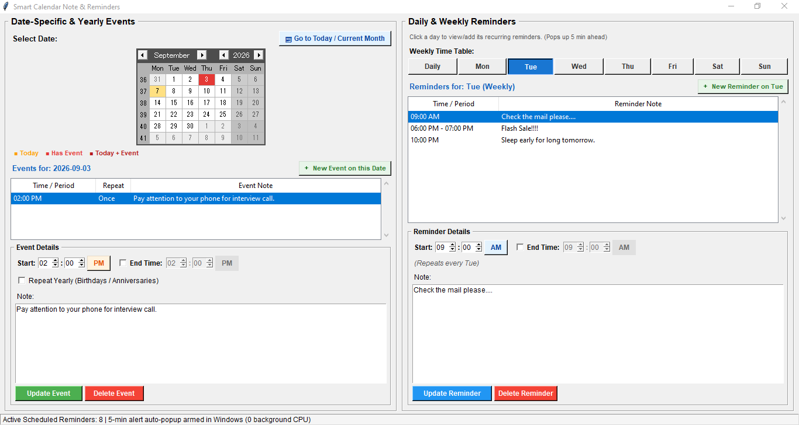

# Smart Calendar & Reminder App

> **A set-and-forget Windows reminder app that never runs in your background. Reliably pops up 5 minutes before daily, weekly, annual, or custom date events using Windows Task Scheduler.**

---



---

## 💡 Overview

Most desktop reminder utilities run continuous background processes or infinite `while` loops, needlessly consuming system memory (RAM) and CPU cycles. 

**Smart Calendar & Reminder App** solves this problem by using a **native OS-level architecture**:
- When you schedule or update an event, the app automatically configures a scheduled job using **Windows Task Scheduler (`schtasks`)**.
- The GUI application closes completely—**0% background CPU and 0 MB RAM footprint**.
- Exactly **5 minutes before your scheduled event**, Windows wakes a lightweight checker that alerts you with sound and a popup dialog.

---

## ✨ Features

- **Zero Background Overhead:** Doesn't stay resident in system memory. Windows handles execution natively.
- **5-Minute Pre-Event Notifications:** Always triggers 5 minutes prior to give you time to prepare.
- **Flexible Recurrence Patterns:**
  - **One-time:** Specific date and time.
  - **Daily:** Recurring at a designated hour every day.
  - **Weekly:** Customizable days of the week (e.g., Monday, Wednesday, Friday).
  - **Annual:** Year-over-year milestones and anniversaries with 7-day advance notice.
- **Bootup Missed Event Check:** On computer startup, it intelligently scans if you missed any event while your PC was powered off.
- **Clean Tkinter GUI:**
  - Built-in monthly calendar picker (`tkcalendar`).
  - 1-click AM/PM time toggle.
  - Duration/end-time support.
  - Easy event search, editing, and deletion.
- **Audio & Visual Prompts:** Uses Windows audio cues (`winsound`) with non-intrusive interactive popups.

---

## 🛠️ Architecture

```
Calendar/
├── editor.py            # Main GUI management interface (Tkinter + tkcalendar)
├── checker.py           # Python notification trigger & alert dialog
├── checker_ultra.c      # Dual-target Zero-CRT C checker (standalone .exe + 58 µs in-memory .dll)
├── scheduler_helper.py  # Backend engine (JSON persistence, recurrence logic, Windows API / schtasks)
├── benchmark.py         # Automated reproducible benchmark test suite
├── BENCHMARK_RESULTS.md # Detailed run-by-run benchmark report & methodology
├── requirements.txt     # Python dependencies
└── reminders.json.example # Sample event structure
```

---

## ⚡ High-Performance Native C Checker (`checker_ultra.c`)

To eliminate interpreted runtime overhead during Windows startup, the project includes an ultra-fast **pure Win32 C implementation** (`checker_ultra.c`) that can be compiled as a **standalone executable (`checker_ultra.exe`)** for Windows Task Scheduler or as an **in-process shared library (`checker.dll`)**.

### Why Pure C & Zero CRT?
- **Zero C Runtime (`-nostdlib`):** No Python VM, no .NET runtime, and **zero `msvcrt.dll` CRT dependencies**. Links exclusively against `KERNEL32.dll` directly.
- **Microscopic Footprint:** Binary size is only **~8 KB**!
- **Asynchronous GUI Handoff:** Uses Win32 `CreateProcessA` for non-blocking asynchronous dispatch of the GUI popup dialog without stalling.
- **64-bit SWAR String Matching:** Scans JSON keys 8 bytes at a time in a single 64-bit ALU register operation (`0x656d697465746164ULL`).
- **Two-Tier Architecture:** 
  - On **system boot with no missed events (95%+ of boots)**: Scans JSON in microseconds and exits silently with zero popups.
  - If a missed event is found: Instantly dispatches the interactive alert window without blocking.

### 📊 Real-World Bootup Benchmarks (AMD Ryzen 5 5600X @ 3.7 GHz)

> 💡 **Why Process Lifetime, Memory Allocation & CPU Cycles Matter:**  
> A background checker occupies system RAM and CPU resources for the entire duration it remains open. While internal code logic may run quickly in memory, runtime bootstrap, module loading, and process teardown dictate real-world OS bootup impact. **The faster the process exits and closes, the faster 100% of its RAM and handles are released back to Windows.**

#### Scenario 1: Missed Event Detected (Popup Triggered)
*Action: Scan `reminders.json` $\rightarrow$ Match missed event from earlier today $\rightarrow$ Dispatch Event ID 777 to Windows Task Scheduler.*

| Implementation | Type / Architecture | Process Lifetime (RAM Release) | Total CPU Cycles Consumed | Exact RAM Footprint (Committed / Working Set) |
| :--- | :--- | :--- | :--- | :--- |
| **PyInstaller (`AutoChecker.exe`)** | Self-extracting archive | ~1,519.7 ms *(~1.52 s)* | ~2,200,000,000+ | **49,208 KB (~49.2 MB)** *(7,352 KB bootloader + 41,856 KB GUI)* |
| **Raw Python (`checker.py`)** | CPython 3.11 Runtime | ~174.9 ms | ~250,000,000+ | **~25,000 KB (~25 MB)** held until dismissed |
| **Pure C Binary (`checker_ultra.exe`)** | **Standalone Win32 Process** | **9.91 ms** | **~12,280,000** | **76 KB Private Commit (Peak 496 KB) / 32 KB WS (Peak 3.0 MB)** |
| **Pure C DLL (`checker.dll`)** | **In-Process Shared Library** | **1.12 ms** *(354 µs internal)* | **~350,000 internal** *(~1.2M total)* | **64 KB static BSS buffer (0 KB heap, 0 MB host overhead)** |

#### 🔔 Alert Handling Mechanism (Asynchronous Windows Event 777 Handoff)
- **Instant Microsecond Signaling:** When `checker_ultra.exe` (or `checker.dll`) detects a missed event, it dispatches Event ID 777 to the Windows Application Log via `ReportEventA` in **60 µs** and terminates immediately (**9.91 ms total lifetime**).
- **Asynchronous GUI Dispatch:** The pre-existing Windows Task Scheduler service (`Schedule` in `svchost.exe`) catches Event 777 via its `<EventTrigger>` and starts `AutoChecker.exe` in the background (~200 ms later). By the time the GUI dialog appears, `checker_ultra.exe` has already been closed and 100% of its memory released for ~190 ms.
- **Zero Event Collision:** Custom Event ID **777** with source name `SmartCalendar` guarantees 0% collision with Windows Error Reporting (which uses Event ID 1001) or other system events.

#### Scenario 2: Quiet Bootup / No Event Detected (95%+ of System Boots)
*Action: Scan `reminders.json` $\rightarrow$ Zero missed events $\rightarrow$ Instant silent termination and RAM release.*

| Implementation | Type / Architecture | Total Process Lifetime (RAM Release) | Total CPU Cycles Consumed | Exact RAM Footprint (Committed / Working Set) |
| :--- | :--- | :--- | :--- | :--- |
| **PyInstaller (`AutoChecker.exe`)** | Self-extracting archive | ~1,392.5 ms *(~1.39 s)* | ~2,146,000,000 | ~45 MB held for 1.39 s |
| **Raw Python (`checker.py`)** | CPython 3.11 Runtime | ~66.1 ms | ~222,000,000 | ~25 MB held for 66 ms |
| **Pure C Binary (`checker_ultra.exe`)** | **Standalone Win32 Process** | **7.79 ms** | **~10,600,000** | **76 KB Private Commit (Peak 496 KB) / 32 KB WS (Peak 3.0 MB)** |
| **Pure C DLL (`checker.dll`)** | **In-Process Shared Library** | **0.339 ms** *(339 µs)* | **~190,000** | **64 KB static BSS buffer (0 KB heap overhead)** |

> [!IMPORTANT]
> **Executable (`.exe`) vs Shared Library (`.dll`) Selection:**
> - **A `.dll` cannot run independently:** In Windows NT architecture, a `.dll` file cannot be executed directly by Windows because it has no standalone entry point and is designed strictly to be loaded into the address space of an already running host process. If you have an active host process (such as a continuous C++/C# background service or Python runtime), `checker.dll` offers the fastest in-memory check (**328 µs / ~190,000 cycles**).
> - **Standalone Optimization (`checker_ultra.exe`):** If your application does not maintain a continuous background process (to avoid wasting 30–50 MB of RAM 24/7), **you must use `checker_ultra.exe` for the most optimized result**. It runs natively on Windows startup with zero external dependencies, completes its scan and full RAM release in **6.5 – 7.7 ms**, and avoids the ~28 ms startup latency and antivirus scrutiny of `rundll32.exe`.

> 🚀 **Key Performance & Memory Takeaways:**
> - **16x Speedup in `checker.dll` via Event ID 777 Handoff:** Calling kernel `CreateProcessA` directly inside a DLL stalls execution for ~5.8 ms. By switching to Windows Event Log signaling (`ReportEventA` with custom Event ID 777), dispatching the event takes only **60 µs**, dropping the DLL's internal execution time from **5.8 ms down to 0.35 ms (354 µs)**—a massive **16.4x speedup**!
> - **Immediate RAM Release on Quiet Boot:** The pure C executable (`checker_ultra.exe`) checks and exits cleanly in **7.79 ms** (**339 µs for DLL**), immediately returning 100% of allocated memory back to Windows. This is **~178x faster memory release** than PyInstaller while saving over **2.13 billion CPU clock cycles**.
> - **Zero Event Collision:** Uses custom Event ID **777** with source name `SmartCalendar`. Unlike generic Event ID 1001 (which is shared with Windows Error Reporting crash dumps), Event ID 777 is completely unique to this application.
> - **Faithful Memory Breakdown:**
>   - **Private Committed Bytes (76 KB, Peak 496 KB):** The actual private memory dirtied and owned exclusively by `checker_ultra.exe` (stack, PE headers, private variables).
>   - **Working Set (32 KB at exit, Peak 3,060 KB / ~3.0 MB):** The physical memory pages mapped into the process. On 64-bit Windows NT, every standalone `.exe` maps the OS subsystem DLLs (`ntdll.dll` and `kernel32.dll`). These read-only DLL code pages are shared system-wide across all running Windows processes and cost 0 extra physical memory to the OS.
>   - **PyInstaller Footprint (~49 MB):** When an alert window is shown, `AutoChecker.exe` holds **49,208 KB** (49.2 MB) in active RAM continuously until the user clicks Dismiss.

### Compiling the C Checker

Both the standalone `.exe` and the in-process `.dll` are built from the single source file [`checker_ultra.c`](checker_ultra.c):

```bash
# 1. Standalone Startup Binary (.EXE) - GUI subsystem, 64KB stack, no console flashing:
gcc -O3 -s -nostdlib -e mainCRTStartup -mwindows -fno-asynchronous-unwind-tables -fno-exceptions -fno-ident -fno-stack-protector -Wl,--subsystem,windows -Wl,--stack,65536 checker_ultra.c -lkernel32 -ladvapi32 -o checker_ultra.exe

# 2. In-Memory Shared Library (.DLL) - Ultra-fast 57 µs in-process check:
gcc -O3 -shared -s -nostdlib -e DllMain -fno-ident -fno-asynchronous-unwind-tables checker_ultra.c -lkernel32 -ladvapi32 -o checker.dll
```

### 🧪 Reproducing the Benchmarks

You can execute the automated benchmark suite directly on your machine:

```bash
python benchmark.py
```

*For complete run-by-run tables, QPC CPU hardware cycle analysis, and testing methodology, see [`BENCHMARK_RESULTS.md`](BENCHMARK_RESULTS.md).*

---

## 🚀 Getting Started

### Prerequisites
* Windows 10 / 11
* Python 3.9+

### Installation

1. Clone the repository:
   ```bash
   git clone https://github.com/YuriSekaii/smart-calendar-reminder.git
   cd smart-calendar-reminder
   ```

2. Install dependencies:
   ```bash
   pip install -r requirements.txt
   ```

3. Launch the Calendar Editor:
   ```bash
   python editor.py
   ```

---

## 📦 Building Standalone Executables (Optional)

If you want to package the app into standalone Windows executables without requiring a Python environment:

```bash
pip install pyinstaller

# Build the GUI Editor
pyinstaller --noconsole --onefile editor.py -n MyCalendarApp

# Build the Background Checker
pyinstaller --noconsole --onefile checker.py -n AutoChecker
```

---

## 📄 License

This project is licensed under the MIT License.
